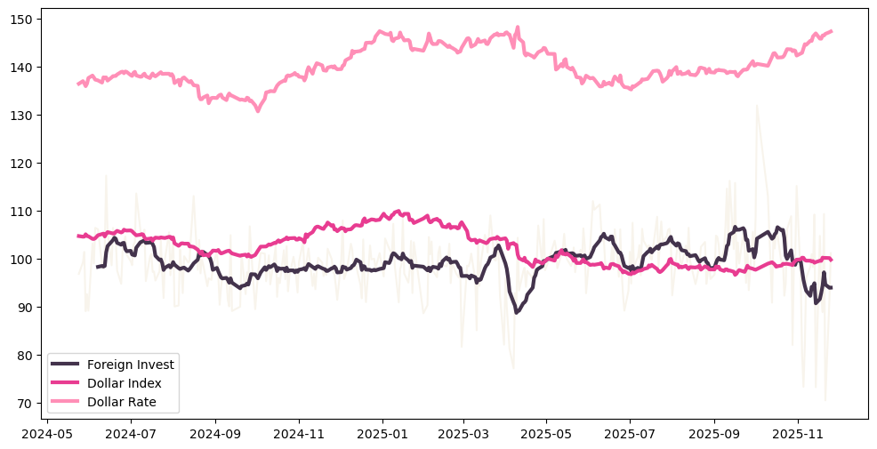
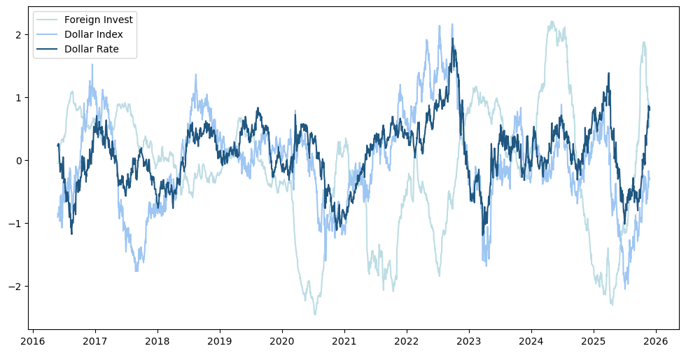
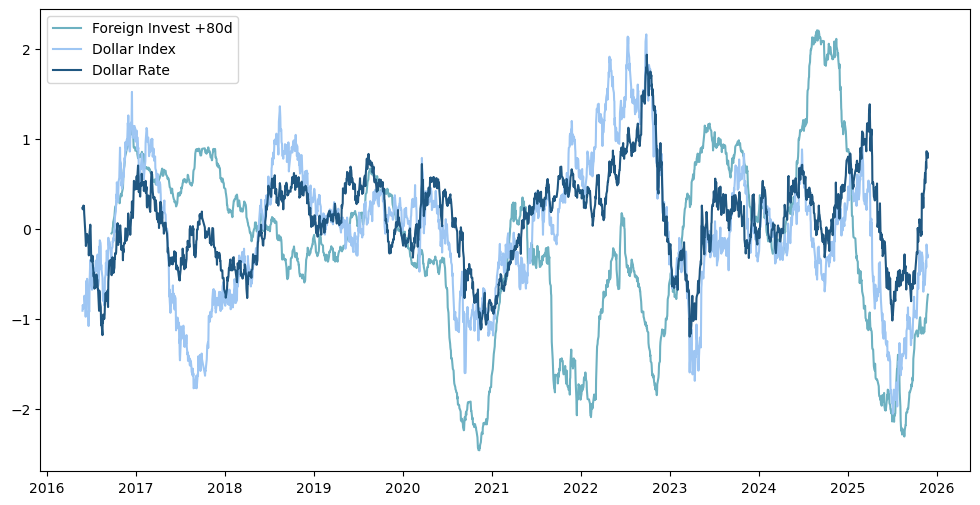
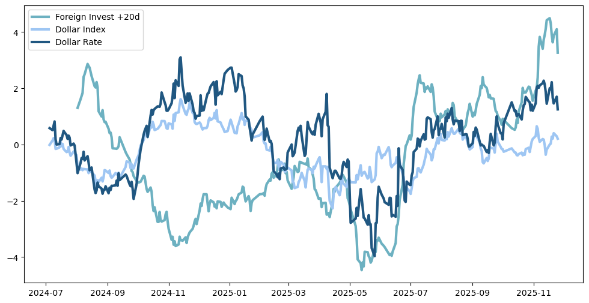

📑 [분석 결과 보고서]

  

### 1. 제목
외국인 매매 동향과 달러 지수가 달러 환율에 미치는 영향

  
  

### 2. 요약

- 목적: 외국인의 국내 주식 매매 동향과 달러 인덱스가 달러 환율에 미치는 영향을 분석하고 최근의 달러 지수와 일치하지 않는 환율의 움직임이 실제로 존재하는지 분석한다.
- 방법: 2015년부터 10년 치 데이터를 파이썬으로 분석하고, 1년치를 별도로 분석하여 상호 비교한다.
결론: 달러 환율은 달러 인덱스와는 일반적으로 정의 상관관계가 분명히 존재하나, 외국인 매매동향과는 조건부 상관관계가 존재한다.

  
  

***

  
  

### 3-1. 데이터 준비

(1) 외국인 매매 동향 데이터(foreign invest)
- 기간: 2015.11.26. ~ 2025. 11. 25.
- 출처: KRX 정보데이터시스템 (https://data.krx.co.kr/contents/MDC/MDI/mdiLoader/index.cmd?menuId=MDC0201020301)
- 전처리 : 2년치 자료 5개를 쿼리로 병합하여 10억 단위로 스케일링한 외국인 순매수 금액 정보만을 남겼다.

(2) 달러 인덱스 데이터(dollar index)
- 기간: 2015.11.26. ~ 2025. 11. 25.
- 출처 : 인베스팅 닷컴 달러 지수(DXY) (https://kr.investing.com/indices/usdollar-historical-data?cid=1224074)
- 전처리 : 날짜별 달러 인덱스 자료만 남기고 모두 제거하였다.

(3) 달러 환율 데이터(dollar rate)
- 기간: 2015.11.26. ~ 2025. 11. 25.
- 출처 : 우리은행 외환센터(https://spot.wooribank.com/pot/Dream?withyou=FXXRT0014)
- 전처리 : 날짜와 기준 환율만을 크롤링한 뒤, 날짜를 문자열이 아닌 날짜 형태로, 기준 환율은 천 원 단위를 구분하는 ',' 를 지워 실수형으로 변환했다.

(4) 전체 통합 데이터
- 전처리 : 세 개 데이터에서 서로 겹치는 날짜를 기준으로 분석 대상을 정하고 나머지 데이터를 삭제하여 병합했다.

  
  

### 4-1. 분석 과정

10년 데이터

1년 데이터

 

외국인 매매 동향 데이터의 변동성이 너무 심해 100을 나눈 뒤 100을 더하는 방식으로 데이터를 정제했다. 그래도 변동성으로 인해 방향성을 알기 어려워 10년 데이터에서는 30일 추세선을, 1년 데이터에서는 10일 추세선을 추가하였다. 각 그래프 상 가장 연한 그래프는 정제한 외국인 매매 동향 데이터이고, Foreign Invest 라는 인덱스가 붙은 선은 추세선이다.

  
  

### 5-1. 핵심 발견

1. 달러 환율과 달러 인덱스의 관계
기본적 방향이 거의 일치한다. 다만, 2022년 이후 괴리가 커지는 디커플링 현상을 보이고 있다. 따라서 기본적인 환율 변동은 달러 인덱스로 설명 가능하나, 최근의 급격한 환율 상승과 큰 변동성은 정부 정책이나 금융 당국의 환율 방어, 국제 정세, 한미 간 금리차 확대와 같은 복합적 요인에 의해 영향 받고 있다고 판단할 수 있다.

2. 달러 환율과 외국인 매매 동향의 관계
기본적으로 일치하지 않는다. 즉, 뚜렷한 상관관계가 있다고 보기 어렵다. 1년치 데이터에서는 변동성이 적을 때에는 어느 정도 일치하는 모습을 보이나 10년치 데이터로 보았을 때에는 그렇지 않다. 따라서 일률적으로 설명할 수 없다.

3. 최근의 환율 변동 원인에 대한 좀 더 상세한 분석을 위해서는 2008년 금융위기 당시의 움직임을 추가로 분석해보면 도움이 될 것이라고 판단된다. 2024년 12월 3일 비상계엄 당시 금융 당국은 1480원 이상으로 치솟은 환율을 직접 개입을 통해 1360원까지 낮췄고, 지금도 국민연금과 협력하여 환율 안정에 힘을 쓰고 있다. 리먼 브라더스 사태 당시에도 환율의 급격한 상승이 크게 문제가 되었고, 당시 정부는 미국과 무제한 환율 스와프를 체결하여 환율 안정에 힘썼다. 물론, 리먼 브라더스 사태는 금융위기 사례로, 세계적인 경기 침체의 시작과 부실 채무로 인한 금융 불안정 문제가 복합되어 있는 작금의 상태를 모두 설명하기는 어렵지만, 어느 정도 참고할 수 있을 것으로 사료된다.

  
  

***

  
  

### 3-2. 데이터 준비

(1) 달러 인덱스 변동분 데이터(dollar index)
- 전처리 : 상동 자료를 날짜별 달러 인덱스 변동 % 자료만 남기고 모두 제거하였으며, 변동 % 자료를 1,000을 곱하는 방식으로 스케일링했다.

(2) 달러 환율 변동분 데이터(dollar rate)
- 전처리 : 상동의 사이트에서 날짜와 원 달러 환율 변동분만을 크롤링한 뒤, 날짜를 문자열이 아닌 날짜 형태로 변환하고, 변동이 없었던 날은 변동분을 0으로 지정해 데이터를 구성했다.

(3) 전체 통합 데이터
- 전처리 : 세 개 데이터에서 서로 겹치는 날짜를 기준으로 분석 대상을 정하고 나머지 데이터를 삭제하여 병합했다.

  
  

### 4-2. 분석 과정

10년 데이터

1년 데이터

 

모든 10년치 그래프를 120일 이평선으로 만들고, 아래의 1년치 그래프들은 30일 이평선으로 만들었다.

  
  

### 5-2. 핵심 발견

0. 달러 인덱스, 외국인 순매수, 원 달러 환율의 상관관계에 대한 결론이다.

1. 단순 추세를 분석한 첫 번째 시각화에서보다 각 데이터의 변동분으로 진행한 2차 분석에서는 외국인 매매 동향이 원 달러 환율에 미치는 영향을 더욱 잘 확인할 수 있다. 완벽하게는 아니나, 외국인 매매 동향이 원 달러 환율에 부적 영향을 미치고 있다고 판단할 수 있으므로, 달러 환율의 방향성을 결정하는 유의미한 변수라고 말 할 수 있다.

2. 1차 시각화의 결론을 적용하여 원/달러 환율이 기본적으로 달러 인덱스와 정의 상관관계를 갖고 있음을 넘어 원 달러 환율이 달러 인덱스에 종속되어 있음을 기본으로 하고, 원/달러 환율과 외국인 순매수가 부의 상관관계를 보일 것이라는 가정에 기반하여, 원/달러 환율이 달러 인덱스의 방향을 무시하고 외국인 순매수와 정의 상관관계를 보이는 비이상적 현상에 집중하였다. 이는 각각 2017년 중반, 2019년 중반에 발생했다.

3. 이러한 현상은 일반적이지 않은 현상으로, 원인을 꼽자면 크게 두 가지를 들 수 있다.
첫째, 달러 자체의 힘과 별개로 한국 내 문제로 인해 원화 약세가 발생했다. 둘째, 외국인은 국내 주식을 순매수한 것보다 국내 투자 자본의 해외 유출이 더욱 컸다.

4. 조사 결과, 2017년에는 삼성전자 주도 하에 반도체 슈퍼 사이클이 발생하여 외국인 매수세가 강렬했으나 북한의 도발이라는 안보상 문제가 발생하여 원화가 약세를 보였다. 2019년에는 미중 무역 갈등이 격화되면서 중국 수출량이 많은 한국의 경제 후퇴가 우려되었고, 일본의 대 한국 수출 규제 정책이 펼쳐지면서 반도체 소재 수급에 문제가 생겨 이러한 우려에 불을 붙이면서 강력한 원화 약세가 촉발되었다.

5. 이러한 원인들은 외국인 순매수와 관계가 있다고 볼 수 없으며, 원화 자체적 문제로 인해 발생한 일시적 우연일 뿐, 이러한 예외적 현상이 외국인 순매수가 원/달러 환율과 부의 상관관계가 있다는 가설을 부정할 수는 없다.

6. 다만, 외국인 순매수가 원 달러 환율과 부의 상관관계가 있다고 말하기 위해서는 외국인 순매수와 달러 인덱스가 서로 역의 관계에 있어야 한다. 원 달러 환율은 기본적으로 달러 인덱스를 추종하므로, 달러 인덱스가 외국인 순매수와 같은 방향으로 움직일 경우(달러도 강세고 외국인도 주식을 살 때), 외국인 수급이 환율에 미치는 영향력은 상쇄되거나 희석될 수 있다는 점을 유의해야 한다.

7. 추가로, 외국인 순매수가 달러 환율에 미치는 영향을 분석하는 과정에서 시차 상관관계가 있는건 아닌지 의문이 들어 아래에 추가로 그래프를 생성하여 분석하고자 한다.

  
  

***

  
  

### 4-3. 분석 과정

10년 데이터

1년 데이터

 

10년 외국인 순매수 그래프를 다른 그래프들과 어느 정도 일치하도록 80일 오른쪽으로 이동시켰다.
1년 외국인 순매수 그래프는 20일 오른쪽으로 이동시켰다.

  
  

### 5-3. 핵심 발견

0. 외국인 순매수가 시차를 두고 원 달러 환율에 미치는 영향에 대해 분석하였다.

1. 외국인의 한국 주식 매도 및 매수가 원에서 달러로의 즉각적인 환전으로 이어지지는 않기 때문에 반드시 외국인 매매 동향이 원 달러 환율에 영향을 준다고는 할 수 없다는 생각이 들었기 때문이다.

2. 시차를 둔 그래프도 기본적으로 원 달러 환율과의 부의 상관관계가 잘 보이나, 시차를 두지 않은 그래프와의 차별성을 파악하기는 어렵다.

3. 따라서 외국인 순매수가 시차를 두고 원 달러 환율에 영향을 미친다고 보기 보다는, 각각 80일과 20일의 시차를 두고도 시차를 두지 않은 그래프와 비슷하게 판단 가능한 것으로 보아 외국인 순매수가 원 달러 환율에 미치는 영향은 경향성을 가진다고 판단하는 것이 옳을 것으로 사료된다.

  
  

***

  
  

### 6. 한계점 및 아쉬운 점
- 크롤링 연습을 위해 달러 환율 데이터를 크롤링하긴 했으나, FinanceDataReader(https://wikidocs.net/172650) 를 사용하면 금융 데이터 분석은 크게 데이터로 문제를 겪을 일이 없을 것으로 보인다.
- 본 분석에서는 전체 외국인 투자 동향만 데이터로 사용했으나, 향후 국내 증시 비중이 높은 반도체 섹터 동향만 따로 분리하여 분석해보는 것도 유의미할 것으로 기대된다.

  
  

### 7. 최종 결론

달러 인덱스가 환율의 '방향'을 정한다면, 외국인 큰 손들의 돈 보따리는 환율의 '운명'을 바꾼다.

